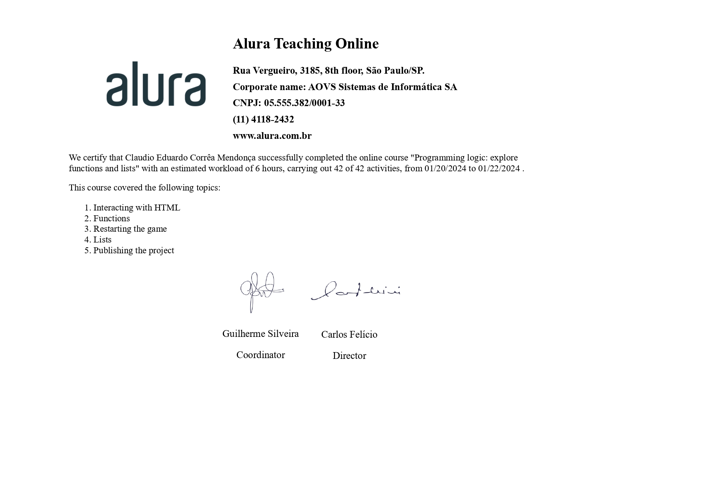

# Alura - ONE Oracle Next Education T6
# Lógica de programação: explore funções e listas - 2º PARTE

Atualmente, estou participando ativamente do programa ONE Oracle Next Education T6, uma colaboração entre a Oracle e a Alura. Estou genuinamente desfrutando da experiência educacional oferecida por este curso, que está focado no aprendizado de Lógica de Programação e na exploração dos fundamentos da programação com JavaScript.
#oraclenexteducation #alura #HelloONET6 #aluracursos #aluraonline #aluraone #aluraoneoracle #aluraoneoracleeducation #aluraoneoracleeducationt6 #aluraoneoracleeducationt6claudiomendon

Link: https://jogoaluraoneoracleeducation.vercel.app/

## Índice

- [Instrutores](#instrutor)
- [Apresentação](#apresentacao)
- [Manipulando textos](#manipulando-textos)
- [Criando uma função](#criando-uma-funcao)
- [Funções com parâmetros](#funcoes-com-parametros)
- [Funções com retorno](#funcoes-com-retorno)
- [Tipo booleano](#tipo-booleano)
- [Verificando o chute](#verificando-o-chute)
- [Contando tentativas](#contando-tentativas)
- [Botão reiniciar](#botao-reiniciar)
- [Reiniciando o Jogo](#reiniciando-o-jogo)
- [Documentação sobre listas](#documentacao-sobre-listas)
- [Implementando a lista](#implementando-a-lista)
- [Limitando os números sorteados](#limitando-os-numeros-sorteados)
- [Speech](#speech)
- [GitHub](#github)
- [Conclusão](#conclusao)
- [Certificado](#certificado)
- [Licença](#licença)

## <a name="instrutor"> Instrutores </a>

[Mônica Hillman](https://github.com/MonicaHillman) - Desenvolvedora de software há mais de 20 anos, com experiência em diversas linguagens e tecnologias. Atualmente, trabalha como desenvolvedora e consultora independente, além de ser instrutora na Alura.

[Guilherme Lima](https://github.com/guilhermeonrails) - Desenvolvedor de software há mais de 10 anos, com experiência em diversas linguagens e tecnologias. Atualmente, trabalha como desenvolvedor e consultor independente, além de ser instrutor na Alura.

A lógica de programação nada mais é do que uma sequência de passos para resolver um problema. Quem vai resolver o problema, nesse caso, é o computador, baseado nas instruções que passamos para ele. Então, precisamos saber quais tipos de instruções o computador entende e qual a melhor forma de passarmos os comandos para nos comunicarmos com ele.

## <a name="apresentacao"> Apresentação </a>

No primeiro curso, utilizamos bastante alert e prompt para interação. Entretanto, ao acessar um e-commerce ou site, não é comum que essas janelas fiquem surgindo na tela, concorda?

Neste curso, nosso objetivo principal é explorar como podemos usar o JavaScript para interagir com a tela de maneira mais sofisticada, semelhante às ferramentas que encontramos no dia a dia. Além disso, vamos consolidar os conhecimentos de lógica de programação e aprimorar nosso projeto do número secreto, incorporando novas funcionalidades e tornando-o visualmente mais atraente. Vamos lá!

## <a name="manipulando-textos"> Manipulando textos </a>

Vamos iniciar nossos estudos analisando o projeto baixado para este treinamento. No Visual Studio, abrimos o projeto, composto pelos arquivos index.html, style.css e app.js, sendo este último o foco do desenvolvimento.

Apesar de semelhante ao curso anterior, há diferenças notáveis. Ao clicar com o botão direito no index.html, optamos por "Open with Live Server" para visualizar o projeto no navegador. A aparência é agora mais próxima de um site real.

A tela mostra uma caixa de texto para inserir o número secreto, botões "Chutar" e "Novo Jogo", e um personagem à direita. O uso do alert prompt foi substituído, destacando a interação direta com o HTML.

A manipulação visual com JavaScript torna o projeto mais dinâmico. Exploramos a seleção de elementos HTML, exemplificada com h1 e p. A tag h1, representando o título principal, é acessada no JavaScript por meio de document.querySelector('h1').

Ao criar a variável "titulo", aplicamos titulo.innerHTML para modificar o conteúdo da tag h1, exibindo "Jogo do número secreto". Similarmente, selecionamos e alteramos o conteúdo do parágrafo (tag p) usando paragrafo.innerHTML.

Essa dinâmica proporciona uma experiência mais realista, evitando prompts invasivos. As alterações feitas refletem um título "Jogo do número secreto" e um parágrafo com "Escolha um número entre 1 e 10" acima da caixa de texto.

## <a name="criando-uma-funcao"> Criando uma função </a>

Estou enfrentando o desafio de reconhecer e implementar a funcionalidade dos botões "Chutar" e "Novo jogo" no projeto. O botão "Novo jogo" está atualmente desabilitado, focando no jogo atual. Nosso objetivo é criar uma ação ao clicar em "Chutar".

Para isso, inspecionamos o botão "Chutar" no HTML, adicionando um elemento onclick com a função "verificarChute()" para indicar que algo deve acontecer no JavaScript quando o botão for clicado.

A função "verificarChute()" é então implementada no arquivo app.js. No HTML, usamos onclick para referenciar a função JavaScript com o mesmo nome. A função JavaScript é introduzida com a palavra-chave "function".

Dentro da função "verificarChute()", definimos o escopo com chaves, onde realizaremos as verificações. Lembre-se da importância de dar nomes descritivos a funções.

A função atual exibe a mensagem "O botão foi clicado!" no console, marcando o funcionamento correto do botão "Chutar". Essa ação é um passo inicial para a implementação mais detalhada do jogo.

## <a name="funcoes-com-parametros"> Funções com parâmetros </a>

Estou explorando a criação e uso de funções, focando em funções com parâmetros. Ao revisar o código, percebo que mesmo para ações diferentes, como manipular elementos distintos (h1 e p), as estruturas são semelhantes. Criamos variáveis para armazenar seleções de elementos e as utilizamos para alterar seus textos.

Embora os campos (título, parágrafo) e tags (h1, p) variem, a lógica subjacente é a mesma. Destaco a possibilidade de aprimorar a eficiência e clareza do código usando funções.

Então, introduzo a função exibirTextoNaTela(tag, texto), que recebe uma tag e um texto como parâmetros. Dentro da função, selecionamos o elemento com a tag fornecida e atualizamos seu conteúdo com o texto.

Demonstro como chamar essa função para manipular tanto o h1 quanto o parágrafo, fornecendo as tags 'h1' e 'p' como argumentos, respectivamente. Além disso, especifico os textos desejados, como 'Jogo do número secreto' e 'Escolha um número entre 1 e 10'.

Exploro a flexibilidade do JavaScript, mostrando que a ordem de declaração e chamada de funções não é restrita. Comento sobre a importância de nomear funções de forma descritiva e explico como as funções com parâmetros podem ser poderosas para tornar o código mais dinâmico e reutilizável.

## <a name="funcoes-com-retorno"> Funções com retorno </a>

Estou introduzindo a criação de funções com retorno para gerar um número aleatório em nosso código. Começo definindo uma função chamada gerarNumeroAleatorio, utilizando Math.random() para gerar um número entre 1 e 10. Destaco a importância da palavra-chave return para indicar que a função deve nos devolver esse número.

Demonstro como armazenar o resultado da função (o número gerado) em uma variável chamada numeroSecreto. Explico que essa função é diferente das anteriores, pois ela retorna uma informação que queremos armazenar.

Mostro que existem diferentes modelos de funções: aquelas sem parâmetros e sem retorno (como verificarChute()), aquelas com parâmetros e sem retorno (como exibirTextoNaTela(tag, texto)), e finalmente, aquelas sem parâmetros e com retorno (como gerarNumeroAleatorio()).

Testo a função, imprimindo o número secreto no console quando o botão "Chutar" é clicado. Observo que o número é gerado apenas na primeira vez que a função é chamada, e subsequentes chamadas apenas imprimem o mesmo número. Destaco a necessidade de entender quando e como invocar funções para obter resultados desejados.

Concluo destacando que agora estamos atribuindo funções a variáveis, uma nova abordagem em relação às variáveis que antes armazenavam apenas strings ou números.

## <a name="tipo-booleano"> Tipo booleano </a>

Agora estou lidando com a interação do usuário no campo de entrada do HTML, onde ele insere um número entre 1 e 10. Ao clicar no botão "Chutar", quero capturar o valor inserido nesse campo e compará-lo com o número aleatório gerado. Começo selecionando o campo input usando document.querySelector('input') e obtendo o valor inserido usando .value. Faço uma comparação, verificando se o valor inserido (chute) é igual ao número secreto (numeroSecreto), e imprimo o resultado no console.

Explico a razão de usar .value em vez de simplesmente armazenar o campo como fizemos com o título e o parágrafo. Destaco a diferença entre = (atribuição) e == (comparação) em JavaScript.

Testo a comparação no console, e como resultado obtenho false, que é um valor booleano indicando que o chute não é igual ao número secreto.

Demonstro que o tipo booleano (verdadeiro ou falso) é comum na programação, explicando como o JavaScript interpreta esses valores. Faço uma manipulação temporária para atribuir um número específico (5) à variável numeroSecreto e, ao inserir 5 no campo de input, obtenho true no console, indicando uma correspondência verdadeira.

Concluo ressaltando a aprendizagem contínua sobre tipos de dados, como string, número e booleano. A seguir, sugiro a possibilidade de usar uma alternativa ao console para exibir uma resposta mais compreensível na tela.

## <a name="verificando-o-chute"> Verificando o chute </a>

Agora, estou implementando a lógica de jogo para fornecer feedback ao usuário após inserir um número no campo de input e clicar no botão "Chutar". Uso estruturas condicionais if() e else() para verificar se o chute é igual ao número secreto ou não.

Explico que ao acertar, exibo mensagens no console e na tela usando a função exibirTextoNaTela(). Testo essa funcionalidade e ajusto as mensagens para indicar que a pessoa acertou e descobriu o número secreto.

Introduzo uma lógica para mensagens de erro, onde informo se o número é maior ou menor que o número secreto. Uso o número gerado aleatoriamente como número secreto e testo o jogo.

Destaco que, mesmo sem alertas e prompts, conseguimos entender a dinâmica do jogo, criar funções e usar retornos. Destaco que há desafios a serem enfrentados nas etapas subsequentes.

## <a name="contando-tentativas"> Contando tentativas </a>

Estou adicionando a funcionalidade de exibir o número de tentativas no jogo que desenvolvemos. Introduzo uma variável chamada tentativas na linha 2 e inicializo com o valor 1, considerando que a primeira tentativa já ocorre no início do jogo.

Atualizo o texto da tag p para incluir a informação sobre o número de tentativas. Utilizo uma template string e a variável tentativas para exibir a mensagem adequada, levando em consideração a conjugação correta da palavra "tentativas" no plural ou singular.

Introduzo uma lógica para determinar se devo usar "tentativas" ou "tentativa" com base no valor de tentativas. Crio a variável palavraTentativa na linha 17 e a utilizo na mensagem exibida.

Ajusto a contagem de tentativas no código, incrementando a variável tentativas sempre que o chute é errado.

Testo o jogo, verificando se as mensagens são exibidas corretamente para diferentes situações, incluindo acertos e erros. Destaco que a contagem considera apenas tentativas erradas, não contabilizando acertos subsequentes.

Ao final, restauro a geração aleatória do número secreto para manter a dinâmica do jogo.

## <a name="botao-reiniciar"> Botão reiniciar </a>

Estou adicionando uma funcionalidade ao jogo para limpar o campo de entrada após cada tentativa. Introduzo uma função chamada limparCampo() que, quando chamada, seleciona o campo de entrada e atribui uma string vazia ao seu valor, tornando-o assim vazio.

Testo a função, digitando números no campo de entrada, realizando tentativas e verificando se o campo é limpo corretamente após cada chute.

Em seguida, identifico no HTML um botão chamado "Novo Jogo" que está desativado inicialmente. Explico como o atributo disabled é responsável por desativar o botão.

Introduzo uma lógica no arquivo JavaScript para habilitar esse botão quando o número secreto for descoberto. Uso a função document.getElementById() para obter o botão específico pelo seu ID "reiniciar". Utilizo a função removeAttribute() para remover o atributo disabled e, assim, habilitar o botão.

Testo a funcionalidade no jogo, realizando chutes até descobrir o número secreto. Confirmo que, ao acertar o número, o botão "Novo Jogo" é habilitado corretamente.

Este é um passo importante para permitir que os jogadores reiniciem o jogo após acertar o número secreto.

## <a name="reiniciando-o-jogo"> Reiniciando o Jogo </a>

Estou adicionando uma funcionalidade ao botão "Novo Jogo". Ao ser clicado, desejo reiniciar o jogo, zerando as tentativas e gerando um novo número secreto. No arquivo HTML, vinculo essa funcionalidade ao botão usando o atributo onclick.

No arquivo JavaScript, crio a função reiniciarJogo(). Dentro dela, atualizo o número secreto chamando a função gerarNumeroAleatorio(), limpo o campo de entrada e reseto o contador de tentativas para 1. Além disso, exibo a mensagem inicial chamando a função exibirMensagemInicial(). Testo essa funcionalidade no jogo, digitando números, acertando o número secreto e reiniciando o jogo com sucesso.

Para evitar a repetição de código, introduzo uma função chamada exibirMensagemInicial() que encapsula as chamadas das funções exibirTextoNaTela(). Depois, modifico a função reiniciarJogo() para usar essa nova função, eliminando a duplicação de código.

Para garantir que a mensagem inicial seja exibida na primeira execução, chamo a função exibirMensagemInicial() fora de qualquer outra função.

Além disso, ao clicar em "Novo Jogo", desabilito o botão novamente, indicando que a interação só deve ocorrer após o acerto do número secreto.

Essas melhorias contribuem para um código mais organizado e modular, facilitando futuras atualizações ou manutenções no jogo.

## <a name="documentacao-sobre-listas"> Documentação sobre listas </a>

Estou introduzindo uma lógica para evitar que um número já sorteado seja escolhido novamente no jogo. Optei por utilizar arrays em JavaScript para armazenar os números sorteados. Inicialmente, aprendo sobre arrays por meio da documentação do JavaScript, observando como criar, acessar elementos e obter o tamanho de uma lista.

Demonstro a criação de arrays usando o exemplo de uma lista de números. Utilizo o console do navegador para praticar a manipulação de listas. Em seguida, explico o conceito de índices em arrays, onde o primeiro elemento tem índice 0, o segundo índice 1, e assim por diante.

Apresento como acessar elementos específicos da lista usando seus índices e mostro como obter o último elemento da lista, independentemente do tamanho, usando a expressão nomeDaLista.length - 1. Destaco a importância de subtrair 1, pois os índices começam do zero.

Destaco a necessidade de evitar índices que não existem para evitar retornos indefinidos. Finalmente, destaco que, embora existam métodos adicionais para manipular listas, o foco do curso não é explorar esses detalhes, mas sim implementar uma lógica específica para o projeto em questão: garantir que números não sejam sorteados repetidamente.

## <a name="implementando-a-lista"> Implementando a lista </a>

Estou explorando a implementação de uma lógica para garantir que os números sorteados no jogo não se repitam. Utilizando arrays em JavaScript, crio uma lista chamada listaDeNumerosSorteados na linha 1 do código. A ideia é armazenar os números sorteados nesta lista para evitar repetições.

Na função gerarNumeroAleatorio(), que está na linha 37, introduzo a variável numeroEscolhido para armazenar o número aleatório gerado. Utilizo a função includes() para verificar se o número já está na lista. Se sim, faço uma chamada recursiva da função para gerar um novo número.

No caso do número não estar na lista, utilizo o método push() para adicioná-lo à listaDeNumerosSorteados. Adiciono um console.log(listaDeNumerosSorteados) para verificar o comportamento no Console.

Antes de testar, limito a geração de números de 1 a 3, ajustando a variável numeroEscolhido. Após a execução do jogo, percebo que o Console só mostra a lista de números sorteados quando acerto o número secreto ou começo um novo jogo.

Ao identificar o número correto como 4, noto que ele só pode ser de 1 a 3. O código realiza novos sorteios até acertar todos os números. Observo que, ao esgotar os números disponíveis, o código gera um erro. Destaco a importância de ter cuidado ao usar recursão em projetos maiores para evitar chamadas excessivas.

## <a name="limitando-os-numeros-sorteados"> Limitando os números sorteados </a>

Estou enfrentando um problema no meu código, onde recebo um erro indicando que atingi o número máximo de chamadas para a função Math.random(). Isso ocorreu porque todos os números disponíveis já foram sorteados e estão presentes na lista.

Para resolver, decido adicionar uma verificação que limpa a lista quando atinge o número máximo de elementos, que agora é 3. Na função gerarNumeroAleatorio(), abaixo da variável numeroEscolhido, crio uma variável quantidadeDeElementosNaLista para armazenar o tamanho da lista. Em seguida, adiciono uma condicional: se a quantidade de elementos na lista for 3, a lista é limpa.

Porém, percebo que esse método limita meu jogo a apenas 3 números sorteados. Para tornar isso dinâmico, crio uma variável chamada numeroLimite no início do código, definindo seu valor como 10. Em seguida, substituo os valores específicos por numeroLimite na função gerarNumeroAleatorio(). Agora, meu jogo sorteia números de 1 a 10, evitando repetições até que todos os números sejam sorteados.

## <a name="speech"> Speech </a>

Adicionei uma funcionalidade de leitura de texto ao meu jogo utilizando a biblioteca ResponsiveVoice em JavaScript. Para isso, importei o código da biblioteca com o script src em uma tag script no HTML. Desta forma, o projeto passou a ter a capacidade de falar.

Fiz uma função, exibirTextoNaTela, que exibe o texto na tela e também utiliza o método responsiveVoice.speak() para a leitura do texto. Inseri essa funcionalidade principalmente quando exibo mensagens iniciais no jogo, como "Jogo do número secreto" e "Escolha um número entre 1 e 10".

A biblioteca requer alguns parâmetros, como o texto a ser falado e o idioma da voz. No meu caso, escolhi "Brazilian Portuguese Female" para falar em português brasileiro. Além disso, é possível ajustar a velocidade da fala, o que fiz utilizando a propriedade {rate: 1.2}.

Após habilitar o som, testei a funcionalidade, e agora o programa é capaz de narrar as mensagens exibidas na tela, proporcionando uma experiência mais interativa no jogo.

## <a name="github"> GitHub </a>

Decidi compartilhar meu jogo desenvolvido recentemente, o "Jogo do Número Secreto", para que outras pessoas possam acessá-lo e jogar diretamente pelo celular. Para fazer isso, escolhi o GitHub como plataforma para armazenar e compartilhar meu código.

Primeiro, criei um repositório no GitHub chamado "jogo-do-numero-secreto" e enviei todos os arquivos do meu projeto, incluindo o HTML, JavaScript e CSS, para esse repositório.

Em seguida, utilizei a plataforma Vercel para realizar o deploy do meu projeto, tornando-o acessível a partir de um endereço online. Após configurar o deploy, a aplicação ficou disponível para acesso.

Acessei a prévia do site gerado pela Vercel, e para minha satisfação, o jogo estava funcionando perfeitamente. Inclusive, adicionei uma funcionalidade de áudio que permitia ao programa narrar as mensagens do jogo.

Testei o jogo no celular, inserindo números e interagindo com a interface, e tudo estava operando conforme o esperado. Encorajei as pessoas a experimentarem o jogo, compartilhando o link e destacando que ele estaria acessível para todos.

Concluí que, ao compartilhar meu código e realizar o deploy, alcancei meu objetivo de permitir que outras pessoas jogassem o "Jogo do Número Secreto" de qualquer lugar do mundo.

## <a name="conclusao"> Conclusão </a>

Chegamos ao fim de mais um treinamento na Alura, onde absorvemos conceitos fundamentais para nossa jornada como desenvolvedores. Desenvolver software, seja criando interfaces ou trabalhando no back-end, envolve dedicação, estudo e esforço.

Neste curso, aprendi a explorar funções e listas em JavaScript, consolidando os conhecimentos de lógica de programação e aprimorando o projeto do número secreto. Além disso, aprendi a utilizar a biblioteca ResponsiveVoice para adicionar uma funcionalidade de leitura de texto ao jogo.

Agora, o jogo está mais dinâmico e interativo, permitindo que os jogadores interajam com a interface e recebam feedbacks visuais e sonoros. Além disso, o jogo está disponível online, permitindo que qualquer pessoa acesse e jogue diretamente pelo celular.

Se os primeiros cursos pareceram um pouco desafiadores e você se perguntou se isso é para você, minha sugestão pessoal é não desistir. Os primeiros passos podem ser complexos, e entender como as coisas acontecem na tela pode parecer confuso, mas é crucial manter a motivação.

A Mônica e o Guilherme também passaram por esses momentos, seja na faculdade ou em trabalhos anteriores. Ter pessoas ao meu lado é essencial nesse processo. Por isso, recomendo que você se junte a uma comunidade, como a Alura, para compartilhar suas dúvidas e conquistas.

## <a name="certificado"> Certificado </a>

## Lógica de programação: explore funções e listas

Parabéns! Você acabou de avançar mais um passo e mergulhou profundamente em conhecimento com a gente.

## <a name="licenca"> Licença </a>

Copyright © 2022 <a href="https://www.claudiomendonca.eng.br" target="_blank">ClaudioMendonca.eng.br</a> . The [MIT License](https://github.com/ClaudioMendonca-Eng/Alura-Oracle-logicadeprog-JavaScript-parte2?tab=MIT-1-ov-file) (MIT)
