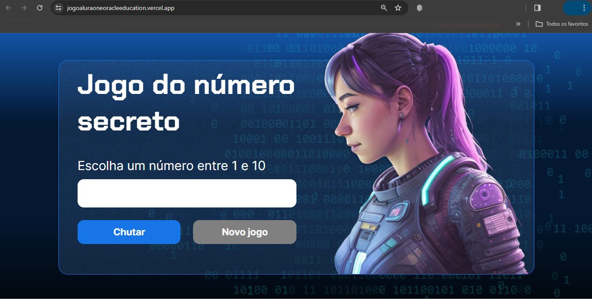

# Alura - ONE Oracle Next Education T6
# Lógica de programação: explore funções e listas - 2º PARTE

Atualmente, estou participando ativamente do programa ONE Oracle Next Education T6, uma colaboração entre a Oracle e a Alura. Estou genuinamente desfrutando da experiência educacional oferecida por este curso, que está focado no aprendizado de Lógica de Programação e na exploração dos fundamentos da programação com JavaScript.
#oraclenexteducation #alura #HelloONET6 #aluracursos #aluraonline #aluraone #aluraoneoracle #aluraoneoracleeducation #aluraoneoracleeducationt6 #aluraoneoracleeducationt6claudiomendon

## Índice

- [Instrutores](#instrutor)
- [Apresentação](#apresentacao)
- [Manipulando textos](#manipulando-textos)
- [Conclusão](#conclusao)
- [Licença](#licença)

## <a name="instrutor"> Instrutores </a>

[Mônica Hillman](https://github.com/MonicaHillman) - Desenvolvedora de software há mais de 20 anos, com experiência em diversas linguagens e tecnologias. Atualmente, trabalha como desenvolvedora e consultora independente, além de ser instrutora na Alura.

[Guilherme Lima](https://github.com/guilhermeonrails) - Desenvolvedor de software há mais de 10 anos, com experiência em diversas linguagens e tecnologias. Atualmente, trabalha como desenvolvedor e consultor independente, além de ser instrutor na Alura.

A lógica de programação nada mais é do que uma sequência de passos para resolver um problema. Quem vai resolver o problema, nesse caso, é o computador, baseado nas instruções que passamos para ele. Então, precisamos saber quais tipos de instruções o computador entende e qual a melhor forma de passarmos os comandos para nos comunicarmos com ele.

## <a name="apresentacao"> Apresentação </a>

No primeiro curso, utilizamos bastante alert e prompt para interação. Entretanto, ao acessar um e-commerce ou site, não é comum que essas janelas fiquem surgindo na tela, concorda?

Neste curso, nosso objetivo principal é explorar como podemos usar o JavaScript para interagir com a tela de maneira mais sofisticada, semelhante às ferramentas que encontramos no dia a dia. Além disso, vamos consolidar os conhecimentos de lógica de programação e aprimorar nosso projeto do número secreto, incorporando novas funcionalidades e tornando-o visualmente mais atraente. Vamos lá!

## <a name="manipulando-textos"> Manipulando textos </a>

Vamos iniciar nossos estudos analisando o projeto baixado para este treinamento. No Visual Studio, abrimos o projeto, composto pelos arquivos index.html, style.css e app.js, sendo este último o foco do desenvolvimento.

Apesar de semelhante ao curso anterior, há diferenças notáveis. Ao clicar com o botão direito no index.html, optamos por "Open with Live Server" para visualizar o projeto no navegador. A aparência é agora mais próxima de um site real.

A tela mostra uma caixa de texto para inserir o número secreto, botões "Chutar" e "Novo Jogo", e um personagem à direita. O uso do alert prompt foi substituído, destacando a interação direta com o HTML.

A manipulação visual com JavaScript torna o projeto mais dinâmico. Exploramos a seleção de elementos HTML, exemplificada com h1 e p. A tag h1, representando o título principal, é acessada no JavaScript por meio de document.querySelector('h1').

Ao criar a variável "titulo", aplicamos titulo.innerHTML para modificar o conteúdo da tag h1, exibindo "Jogo do número secreto". Similarmente, selecionamos e alteramos o conteúdo do parágrafo (tag p) usando paragrafo.innerHTML.

Essa dinâmica proporciona uma experiência mais realista, evitando prompts invasivos. As alterações feitas refletem um título "Jogo do número secreto" e um parágrafo com "Escolha um número entre 1 e 10" acima da caixa de texto.
